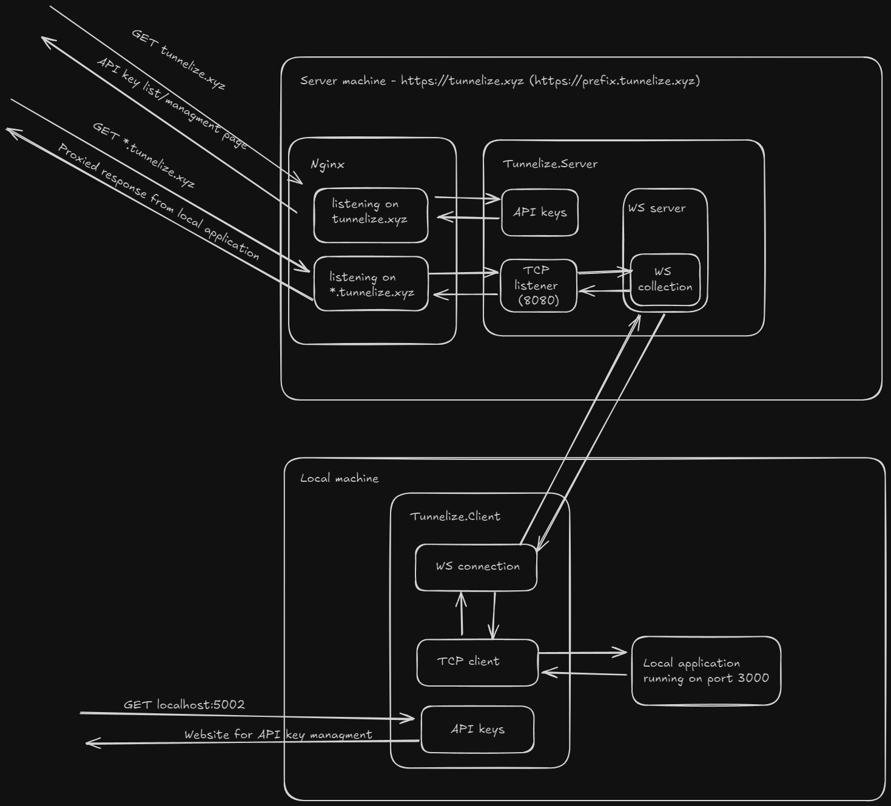

# Tunnelize

Simple "tunneling" software made in C#. Made as a  example/showcase project.

## Project structure 📁
 - `Tunnelize.Client` - code for local client application
 - `Tunnelize.Server` - code for server application
 - `Tunnelize.Shared` - shared code

## How does it work? 🤔
A little image tells a thousand words so take a look at the image below which explains inner works of Tunnelize:

So in short server component will be listening on 2 interfaces. One which is used for user login and API key managment. You can create new keys on that website which will be assigned to new prefixes that can be used by the client component. Client component can then use the API key to connect to the server component and expose the local application via the related prefixed url.

## References
 - https://dev.to/progrium/building-your-own-ngrok-in-130-lines-2lif
 - https://www.webhi.com/how-to/generate-lets-encrypt-wildcard-certificates-nginx/
 - https://earthly.dev/blog/build-your-own-ngrok-clone/
 - https://github.com/BenMcH/node-grok